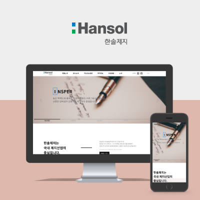
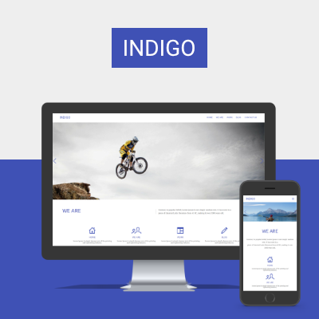
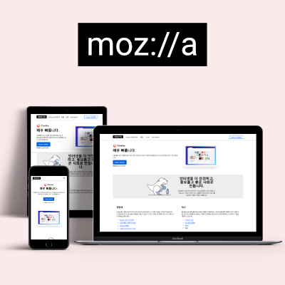
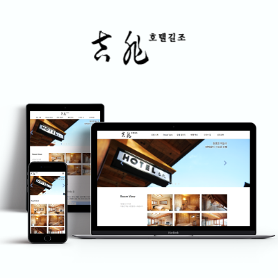
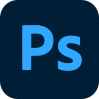
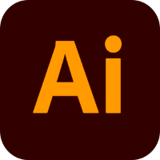
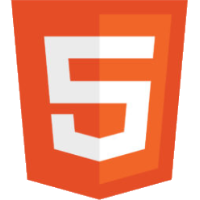
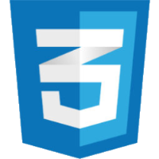
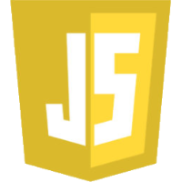
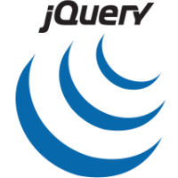

# 포트폴리오 
## 개발환경
 

- OS
  - Windows
  - Mac
- Tools
  - PhotoShop 
  - Illustrator 
  - Visual Studio Code 
  - Atom
 
---
 

## 프로젝트
 

제가 진행한 `프로젝트`를 소개합니다.   

  
  
  
  

 

---
 

## 도구들
 

저는 이러한 `tools`를 사용합니다.    

   
  
  
      
  
  
  
  

 

---
 

## 연락처
 

daaechoi18@gmail.com
